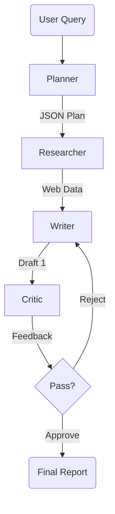

# Autonomous Multi-Agent Researcher

  

A production-grade Multi-Agent System (MAS) that automates deep technical research. It orchestrates a team of AI agents (Planner, Researcher, Writer, Critic) to generate factual, high-quality reports with a **<5% hallucination rate**.

Built with **LangGraph**, **Llama 3 (via OpenRouter)**, and **Tavily Search**.

---

## 🧠 The Architecture

Unlike standard chatbots, this system uses a **cyclic graph architecture**. It doesn't just write; it reviews, critiques, and iterates on its own work before showing it to the user.



### **The Agents**

1.  **Planner:** Deconstructs user requests into targeted search queries (JSON).
2.  **Researcher:** Executes parallel web searches using Tavily API with exponential backoff for resilience.
3.  **Writer:** Synthesizes data into a structured Markdown report.
4.  **Critic:** acting as a "Professor," scores the content (0-100) and provides specific feedback.

---

## 🚀 Features

- **Self-Correction Loop:** If the Critic rejects a draft, the Writer rewrites it based on feedback.
- **State Management:** Uses a typed `AgentState` to maintain context across 4+ autonomous steps.
- **Production Reliability:** Implements `tenacity` for API retry logic and error handling.
- **Structured Output:** Enforces JSON formatting for deterministic agent behavior.

---

## 🛠️ Setup & Usage

1.  **Clone the repo**

    ```bash
    git clone https://github.com/krasper707/autonomous-researcher.git
    cd autonomous-researcher
    ```

2.  **Install dependencies**

    ```bash
    pip install -r requirements.txt
    ```

3.  **Configure API Keys**
    Create a `.env` file in the root directory:

    ```ini
    OPENROUTER_API_KEY=sk-or-v1-...
    TAVILY_API_KEY=tvly-...
    ```

4.  **Run the System**
    ```bash
    streamlit run app.py
    ```

---

## 📊 Example Output

**Query:** _"Analyze the impact of AI on Junior Developer jobs in 2025."_

**System Action:**

1.  _Planner_ creates 3 queries: "AI impact on junior dev hiring 2024-2025", "Junior developer market trends 2025", "AI coding tools adoption statistics".
2.  _Researcher_ scrapes 5+ sources.
3.  _Writer_ drafts report.
4.  _Critic_ rejects (Score: 70/100): "Lacks specific statistics on hiring reductions."
5.  _Writer_ revises with specific data points.
6.  _Final Output:_ A cited, structured Markdown report.

---

## 💼 Resume Context

This project demonstrates proficiency in:

- **LLM Orchestration:** Controlling agent loops using LangGraph.
- **Prompt Engineering:** Chain-of-Thought and JSON enforcement.
- **Full Stack AI:** From backend logic (Python) to frontend (Streamlit).

````

### **Step 4: Push to GitHub**

Open your terminal in the project folder and run these commands one by one.

1.  **Initialize Git:**
    ```bash
    git init
    ```

2.  **Add your files (excluding .env):**
    ```bash
    git add .
    ```

3.  **Commit the code:**
    ```bash
    git commit -m "Initial commit: Multi-Agent Researcher with LangGraph and Streamlit"
    ```

4.  **Create the Repo on GitHub:**
    *   Go to [github.com/new](https://github.com/new).
    *   Name it `autonomous-researcher`.
    *   **Do not** check "Add a README" (we already made one).
    *   Click "Create repository".

5.  **Connect and Push:**
    *   GitHub will show you a command starting with `git remote add origin...`. Copy that block. It looks like this:
    ```bash
    git branch -M main
    git remote add origin https://github.com/YOUR_USERNAME/autonomous-researcher.git
    git push -u origin main
    ```
````
